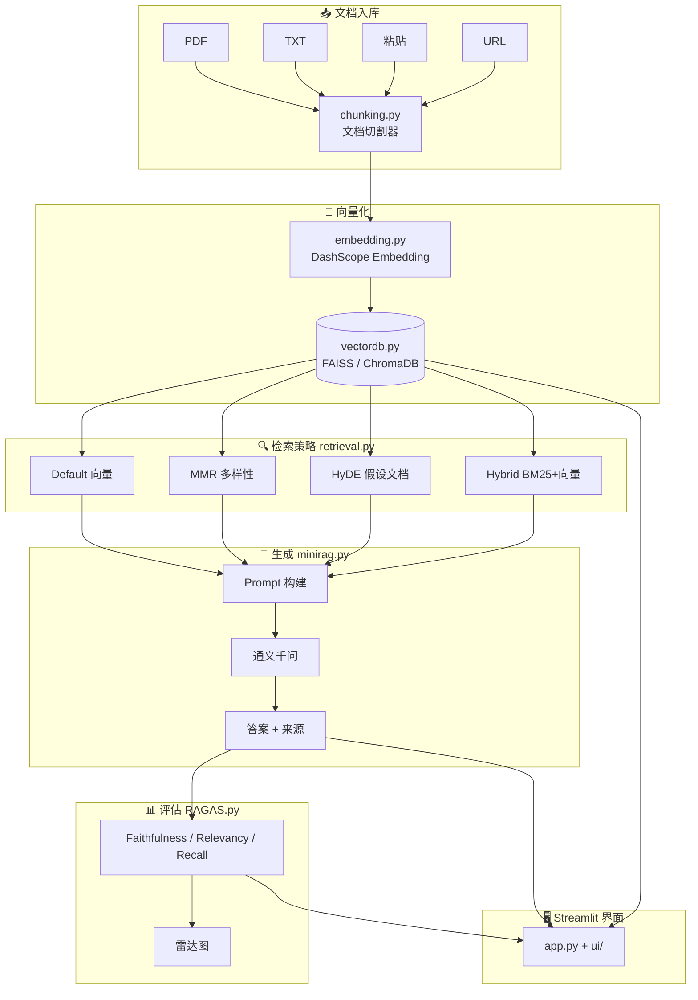

# 🔬 MiniRAG — 从零构建的 RAG 实验平台

一个**教学级** Retrieval-Augmented Generation (RAG) 系统，从手写向量检索到完整 Streamlit 实验平台。适合学习 RAG 原理、面试准备、快速原型验证。

## 🏗 系统架构



## ✨ 特性

- **4 种检索策略**: Default (向量) / MMR (多样性) / HyDE (假设文档) / Hybrid (向量+BM25)
- **全渠道文档入库**: PDF / TXT / 粘贴文本 / URL 抓取 / 预设知识库
- **策略对比实验室**: 同 query 多策略并排对比 + 检索重叠分析
- **RAGAS 评估**: 单条实时评估 + 批量评估 + 雷达图可视化
- **生产级工程**: 配置管理 / 异常体系 / 日志 / 类型标注 / 来源追溯
- **Streamlit 全功能界面**: 5 Tab 实验平台，开箱即用

## 🚀 快速开始

### 1. 安装依赖

```bash
pip install -r requirements.txt
```

### 2. 配置 API Key

```bash
# 复制 .env.example 为 .env，填入你的 DashScope API Key
cp .env.example .env
```

> 获取 Key: [阿里云 DashScope 控制台](https://dashscope.console.aliyun.com/apiKey)

### 3. 启动界面

```bash
streamlit run app.py
```

浏览器访问 `http://localhost:8501`

## 📖 项目结构

```
RAG/
├── app.py               # Streamlit 主入口 (5 Tab 路由)
├── ui/                  # 界面模块
│   ├── chat.py          #   Tab 1: 智能问答
│   ├── documents.py     #   Tab 2: 文档管理
│   ├── lab.py           #   Tab 3: 策略实验室
│   ├── eval.py          #   Tab 4: RAGAS 评估
│   ├── settings.py      #   Tab 5: 设置
│   └── components.py    #   复用 UI 组件
├── minirag.py           # 核心引擎: MiniRAG, Retriever, Generator
├── retrieval.py         # 高级检索: MMR, HyDE, BM25, Hybrid
├── RAGAS.py             # 评估引擎: Faithfulness, Relevancy, Recall
├── embedding.py         # DashScope Embedding 封装
├── chunking.py          # 文档切割器 (固定大小 / 按句子)
├── vectordb.py          # FAISS + ChromaDB 向量存储
├── demo_knowledge.txt   # 预设知识库 (LightSpeed Tech 公司文档)
├── requirements.txt     # 依赖清单
└── .env.example         # 环境变量模板
```

## 🎯 检索策略对比

| 策略 | 原理 | 适用场景 |
|------|------|---------|
| **Default** | 纯向量相似度检索 | 通用，基线 |
| **MMR** | 最大边际相关性，平衡相关度与多样性 | Top-K 结果重复时 |
| **HyDE** | LLM 生成假设答案再检索 | 短查询、query-document 语义鸿沟 |
| **Hybrid** | 向量 + BM25 双路融合 | 需要精确关键词匹配 |

## 🛠 技术栈

- **Embedding**: 阿里云 DashScope (text-embedding-v1/v2/v3)
- **LLM**: 通义千问 (qwen-turbo / qwen-plus / qwen-max)
- **向量库**: FAISS (内存) + ChromaDB (可选持久化)
- **分词**: jieba (BM25 中文分词)
- **前端**: Streamlit
- **评估**: 自实现 RAGAS (Faithfulness / Answer Relevancy / Context Recall)
- **可视化**: Plotly (雷达图)

## 🐛 踩坑记录

开发过程中踩过的坑，面试可能被问到"你遇到什么问题，怎么解决的？"

| # | 问题 | 原因 | 解决方案 |
|---|------|------|---------|
| 1 | **HyDE 生成空内容** | LLM 返回空 → 后续 embedding 失败 | 检查 `resp.output.text` 是否为空，空则退回原 query |
| 2 | **FAISS 索引维度不匹配** | `text-embedding-v2` 实际维度 1536，代码写死 1024 | 用 `len(embedding[0])` 动态获取，不写死 |
| 3 | **BM25 中文分词不准确** | 英文空格分词对中文无效 | 引入 jieba 做中文分词，过滤单字 |
| 4 | **Hybrid 两路分数不可比** | 向量余弦相似度 [0,1] vs BM25 分数 [0, ∞) | Min-Max 归一化后加权求和 |
| 5 | **检索结果全相同** | Top-K 全部语义重复（同主题文档） | MMR 重排序：λ×相关度 - (1-λ)×最大重复度 |
| 6 | **短 query 检索效果差** | "怎么养猫"与长文档语义分布不同 | HyDE：LLM 生成假设答案 → 用假设答案检索 |
| 7 | **ChromaDB 持久化路径错误** | Windows 反斜杠路径问题 | 用 `Path` 对象，不用字符串拼接 |

## 🧠 Week 2 知识总结（Prompt 工程 + Agent）

> Day 12-14 学习内容，面试高频考点

### Prompt 工程四大要素

| 要素 | 说明 | 示例 |
|------|------|------|
| **角色** | 明确身份 + 行为边界 | "你是客服，不要回答技术实现" |
| **知识** | 声明知识范围 | "只根据下方参考文档回答" |
| **约束** | 格式/长度/语言/禁止词 | "用 JSON 格式输出" |
| **拒答** | 兜底机制 | "不知道就说不知道" |

### Prompt 技巧对比

| 技巧 | 原理 | 适用场景 |
|------|------|---------|
| **Few-shot** | 给 2-3 个示例 → 模型模仿格式 | 需要固定输出格式 |
| **CoT** | 展示推理步骤 → 模型学会一步步想 | 数学/逻辑/多步推理 |
| **System Prompt** | 顶层约束，设定角色和规则 | 所有场景都需要 |

### Function Calling 五步流程

```
用户问题 → LLM 选工具+提取参数 → 代码层执行函数
→ 结果拼回对话 → LLM 生成最终回复
```

> **关键**：LLM 不执行任何函数！它只决定调哪个工具，代码层真正执行。

### Prompt Injection 四层防御

```
输入检测 → 分隔符隔离 → 输出过滤 → 权限最小化
```

### Agent ReAct 循环

```
Thought（思考）→ Action（调工具）→ Observation（看结果）
    ↑                                              ↓
    └──────────── 信息不够，继续循环 ←───────────────┘
                        信息够了 → Final Answer
```

## 📄 License

MIT
